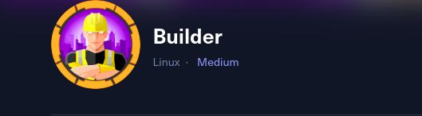
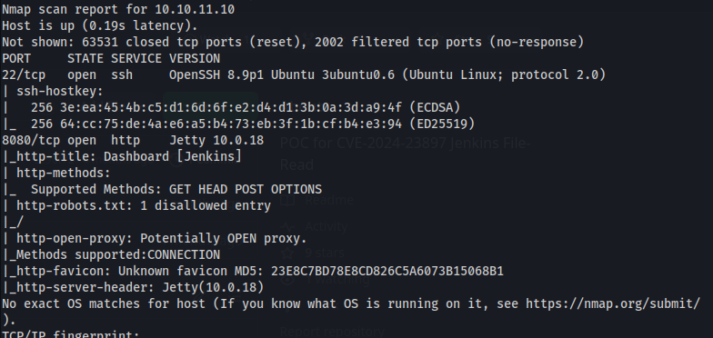
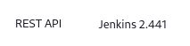
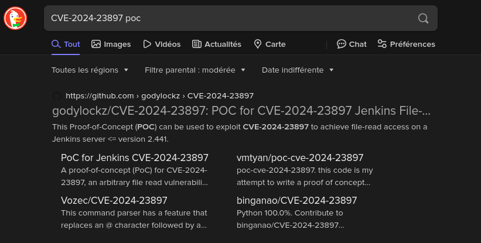
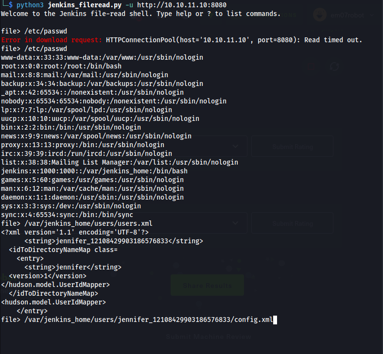
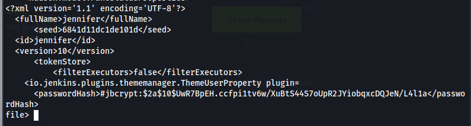
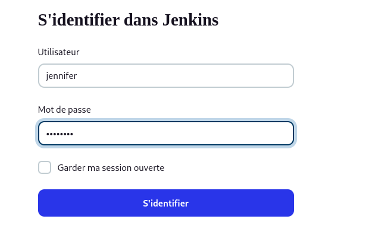
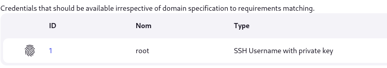
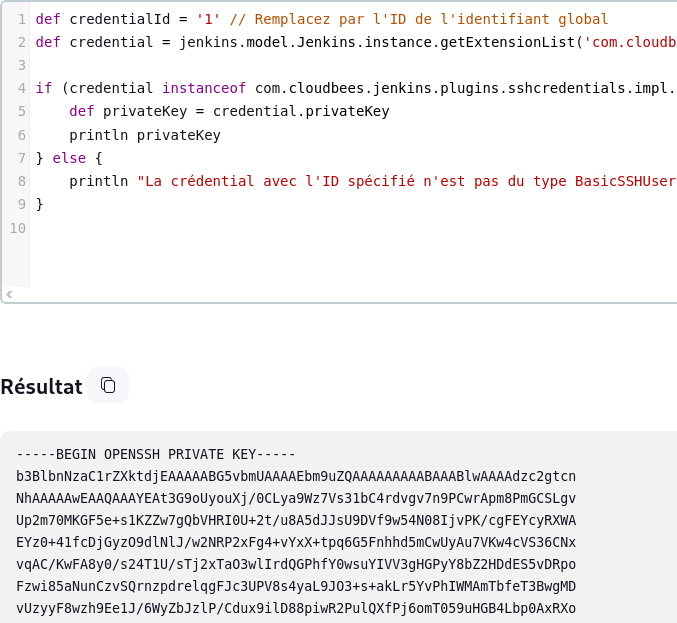
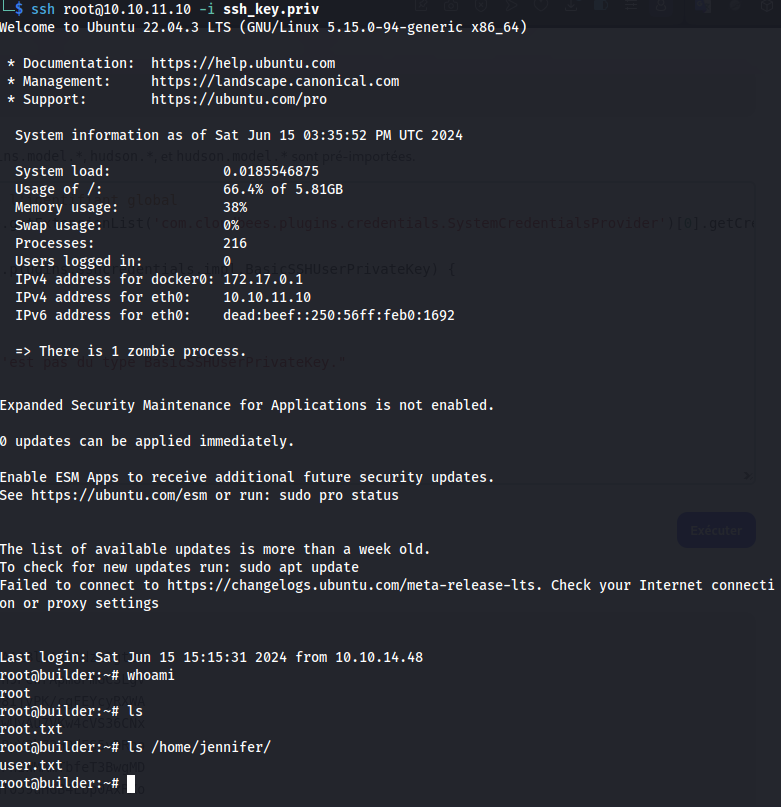

# HackTheBox: Builder



## Étapes de l'attaque

La première étape consistait à scanner la machine cible pour découvrir les services ouverts et les vulnérabilités potentielles. J'ai lancé un scan avec Nmap en utilisant la commande suivante :

```bash
sudo nmap -p- -Pn --min-rate 10000 -v -A -oA builder 10.10.11.10
```
- Résultats du scan Nmap





### Recherche de vulnérabilté

En recherchant des informations sur le serveur Jenkins, j'ai découvert qu'il était vulnérable à une lecture de fichier arbitraire avec le CVE `CVE-2024-23897`.



### Exploitation de la vulnérabilité

J'ai téléchargé le script [jenkins_fileread.py](https://github.com/godylockz/CVE-2024-23897) et je l'ai exécuté pour trouver des données sensibles.



Finalement, j'ai obtenu le hash de l'utilisateur `jennifer`.



### Cracking du hash

J'ai utilisé John The Ripper pour cracker le mot de passe


### Connexion au serveur Jenkins

Je me suis connecté au tableau de bord du serveur Jenkins avec les informations d'identification obtenues.



### Escalade de privilèges

Je me suis souvenu d'un challenge précédent réalisé avec un ami [0xMR8anem](https://0xmr8anem.medium.com/) sur le defi [Impostor](https://0xmr8anem.medium.com/l3akctf-2024-forensics-writeups-3b5575f07cba), et j'ai décidé d'essayer une méthode similaire ici.

En cherchant des utilisateurs sur le serveur Jenkins, j'ai découvert que l'utilisateur root était présent à `http://10.10.11.10:8080/credentials/store/system/domain/_/` avec l'ID 1.



Je suis allé sur `http://10.10.11.10:8080/script` et j'ai exécuté le script suivant pour obtenir la clé privée SSH de l'utilisateur root 

```bash
def credentialId = '1' // Remplacez par l'ID de l'identifiant global
def credential = jenkins.model.Jenkins.instance.getExtensionList('com.cloudbees.plugins.credentials.SystemCredentialsProvider')[0].getCredentials().find { it.id == credentialId }

if (credential instanceof com.cloudbees.jenkins.plugins.sshcredentials.impl.BasicSSHUserPrivateKey) {
    def privateKey = credential.privateKey
    println privateKey
} else {
    println "La crédential avec l'ID spécifié n'est pas du type BasicSSHUserPrivateKey."
}

```


### Connexion en tant que root 

J'ai obtenu la clé privée SSH et me suis connecté en tant que root.



### Machine pwned

La machine est maintenant compromise.


