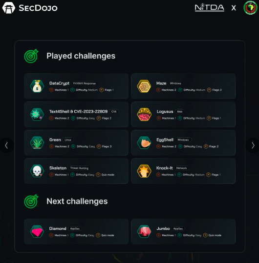
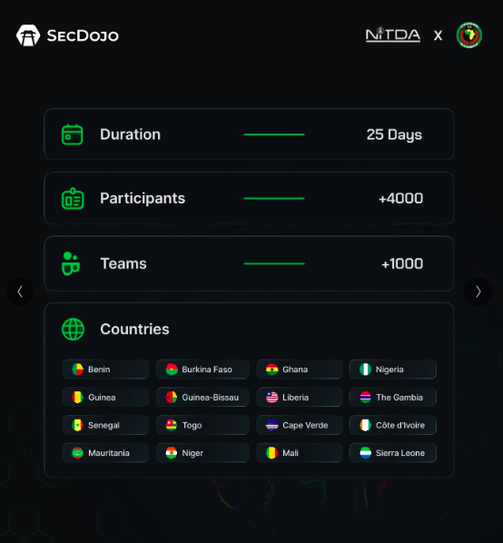

# ECOWAS Hackathon 2024

Le Hackathon de la CEDEAO est une compétition annuelle de hacking éthique qui réunit les meilleurs talents en cybersécurité de toute la CEDEAO. Il offre une opportunité unique de mettre en valeur ses compétences, d'encourager le partage des connaissances et de promouvoir l'excellence dans le domaine de la cybersécurité.

     
