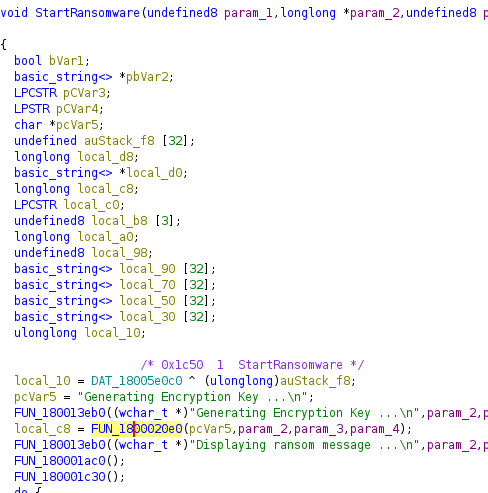

# SecDojo:  DataCrypt


Mon objectif était de localiser et d'analyser le malware, de comprendre son mécanisme d'infection, puis de déchiffrer les données pour récupérer le flag.

## Accès Initial

Je me suis connecté à la machine infectée via RDP en utilisant les informations d'identification fournies. Une fois connecté, j'ai commencé à examiner les tâches planifiées pour identifier une éventuelle tâche suspecte pouvant être liée au ransomware.

## Identification de la Tâche Malveillante

J'ai d'abord utilisé `regedit` pour vérifier les tâches planifiées via l'interface graphique de Windows.


En explorant la clé de registre suivante : `HKEY_LOCAL_MACHINE\SOFTWARE\Microsoft\Windows\CurrentVersion\Run`. Cette clé de registre est utilisée pour lancer des programmes au démarrage de Windows. J'ai trouvé une entrée associée au ransomware, nommée `ransomware101`.


Pour confirmer cette découverte, j'ai utilisé l'invite de commandes pour examiner la tâche planifiée :

```cmd
schtasks
schtasks /query /tn "EvilTask" /fo LIST /v
```
    

J'ai découvert que la tâche était configurée pour s'exécuter au démarrage avec la commande suivante : 

```cmd
rundll32 C:\ProgramData\Microsoft\r101.dll,StartRansomware
```
## Exfiltration

Je me suis rendu dans le répertoire `C:\ProgramData\Microsoft` et j'ai extrait le fichier `r101.dll` pour une analyse plus approfondie.  En parallèle, j'ai découvert un exécutable nommé `decryptor101.exe` dans le dépôt du malware. En l'exécutant, j'ai constaté qu'il nécessite une clé pour déchiffrer les données chiffrées.


### Configuration du Listener && Préparation et Transfert du Fichier

Sur mon hôte, j'ai configuré un listener pour recevoir les fichiers exfiltrés en utilisant nc. Sur la machine cible, j'ai converti le fichier `r101.dll` en base64 pour faciliter son transfert, j'ai utilisé PowerShell pour envoyer le fichier encodé en base64 à mon hôte. 

  

Une fois le fichier reçu sur mon hôte, j'ai décodé le fichier base64 pour obtenir le fichier binaire original.


## Analyse du Binaire

- Analyse avec Ghidra

Le fichier `r101.dll` a été analysé avec Ghidra. Pendant l'analyse, j'ai identifié la fonction main, qui appelle ensuite la fonction `StartRansomware`. Cette fonction semble jouer un rôle clé dans le chiffrement des données.

    

J'ai commencé à étudier plus en détail la fonction StartRansomware pour comprendre comment elle implémente le chiffrement



J'ai trouvé une fonction dédiée à la génération de la clé.


Cette fonction réalise les opérations suivantes:
- Obtention du Hostname et de l'Adresse MAC:
Une fonction récupère le hostname de la machine. Une autre fonction récupère l'adresse MAC.

    

- Génération de la Clé:
La fonction concatène le hostname et l'adresse MAC et un hash MD5 est appliqué à la chaîne combinée pour produire la clé de chiffrement.


Cette clé est ensuite utilisée pour chiffrer les fichiers sur la machine infectée.

## Déchiffrement du Flag

Une fois que j'ai obtenu les détails de la fonction de génération de clé dans StartRansomware, j'ai suivi ces étapes pour obtenir la clé et  déchiffrer les données.
J'ai accédé à la machine infectée pour récupérer les informations nécessaires à la génération de la clé de chiffrement.


 J'ai généré la clé de chiffrement en suivant le processus décrit par le programme.
 
 
 
 Avec la clé MD5 obtenue, j'ai utilisé l'exécutable `decryptor101.exe` trouvé dans le dépôt du malware pour déchiffrer le flag.
 
 
 
 J'ai donc réussi à `pwner` le challenge en identifiant, analysant, le ransomware.
 
  
 
