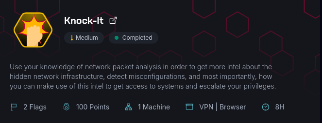
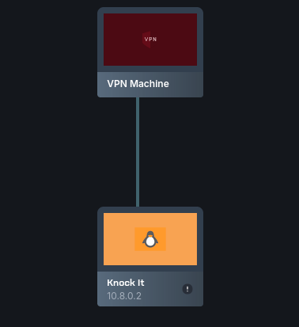
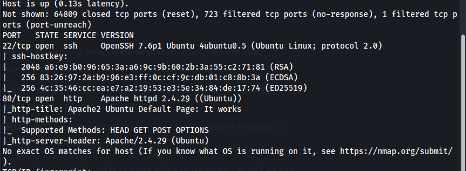
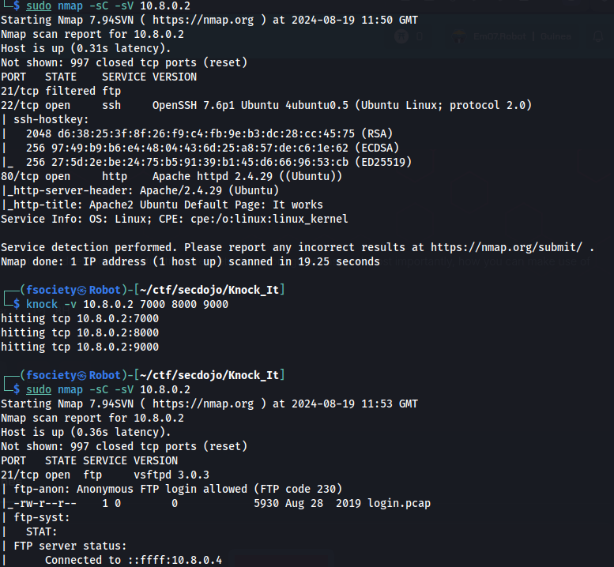
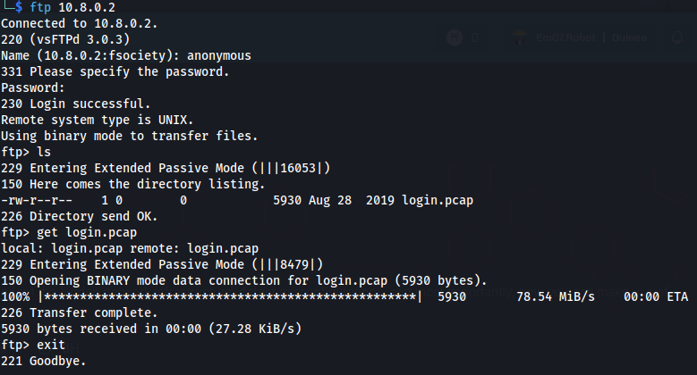
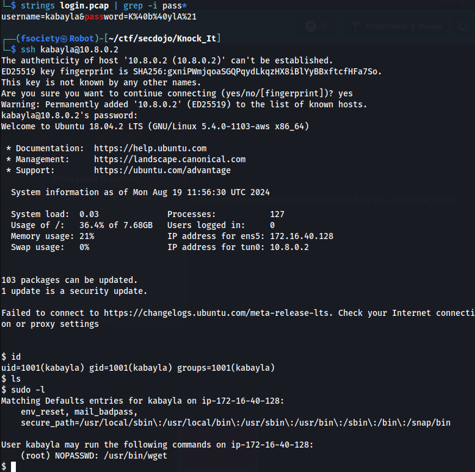
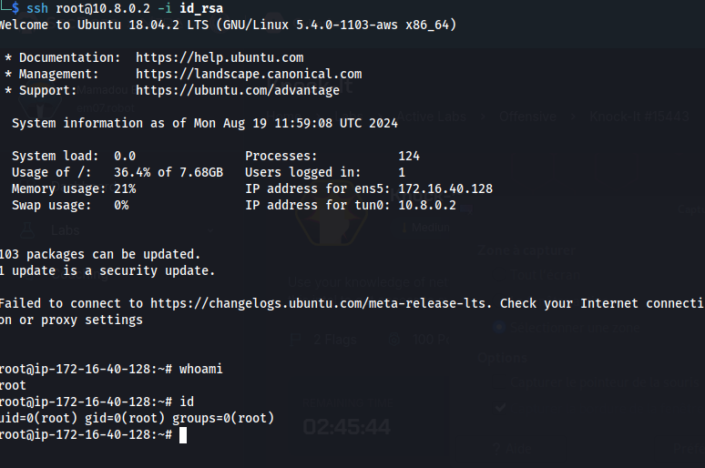
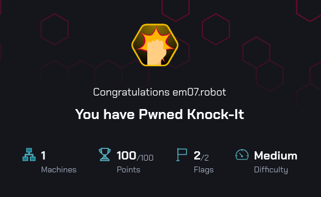

# SecDojo: Knock-it

## Scan

J'ai commencé par effectuer un scan Nmap pour identifier les ports ouverts sur la machine cible. 

## Investigation du port filtré

Le scan a révélé les ports 22 et 80 sont ouverts, mais j'ai remarqué qu'un port était filtré, ce qui a immédiatement attiré mon attention.En approfondissant l'analyse, j'ai pu confirmer que c'est le port 21 qui est filtré.J'ai commencé à suspecter que la machine utilisait une technique de port knocking, comme indiqué dans le challenge.

En me basant sur une séquence de port knocking par défaut souvent utilisée pour SSH, j'ai exécuté la séquence suivante `knock -v 10.8.0.2 7000 8000 9000`

## Exploration du service FTP

Cette séquence a réussi à ouvrir le port 21. J'ai ensuite tenté de me connecter via FTP en utilisant le compte `anonymous`, ce qui m'a permis d'accéder au service.

Une fois connecté en FTP avec le compte `anonymous`, j'ai trouvé un fichier intéressant nommé `login.pcap`. Je l'ai téléchargé pour une analyse

## Analyse du fichier et Connexion 

J'ai utilisé la commande `strings` pour extraire les chaînes de caractères lisibles du fichier `login.pcap`. Cette méthode a permis d'extraire directement les informations d'identification, révélant un nom d'utilisateur et un mot de passe. Avec les identifiants en main, j'ai tenté une connexion SSH. La connexion a été réussie, me donnant accès à la machine en tant qu'utilisateur `kabayla`. En explorant les privilèges de l'utilisateur, j'ai remarqué que la commande `wget` pouvait être exécuté avec des privilèges `sudo` sans restriction.

## Escalade de privilèges via wget

J'ai exploité cette situation pour télécharger une clé SSH dans le répertoire root, en ajoutant ma clé publique à `/root/.ssh/authorized_keys`.

Cette action m'a donné un accès complet à la machine en tant que root, complétant ainsi l'exploitation.

