# SecDojo: Logusus

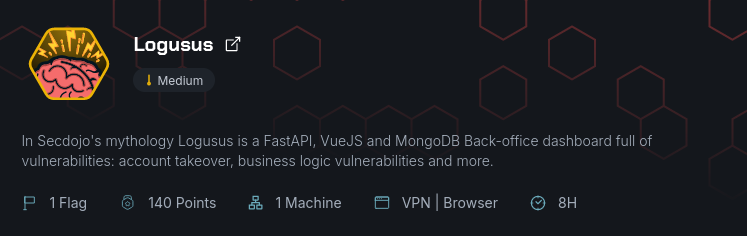

## Scan Initial

J'ai commencé par effectuer un scan Nmap pour identifier les ports ouverts sur la machine cible.

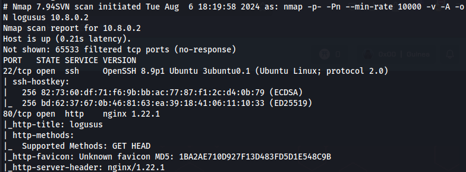

Le scan Nmap a révélé que les ports 22 (SSH) et 80 (HTTP) sont ouverts sur la machine cible.

## Accès au site web

Je me rends sur mon navigateur et découvre une page de login avec un champ pour l'email et le mot de passe.

### Interception de la requête avec Burp Suite

Je capture la requête de login avec Burp Suite.

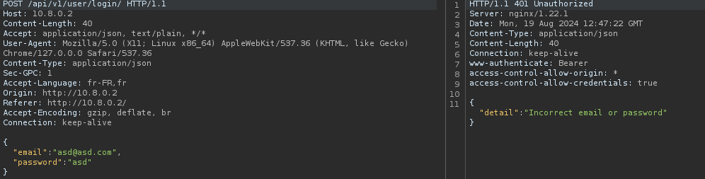

La requête POST est envoyée à l'api `/api/v1/user/login/`

### Exploration de l'API

En inspectant l'API, j'ai découvert l'api `/api/v1/user/public`, qui expose des informations sur les utilisateurs.

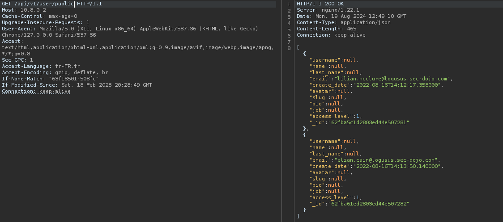

Cela m'a permis d'avoir les adresses email valides. Après une recherche, j'ai trouvé l'API qui permet de changer les mots de passe. Je choisis un utilisateur et modifie son mot de passe via l'api `/api/v1/user/password/`.

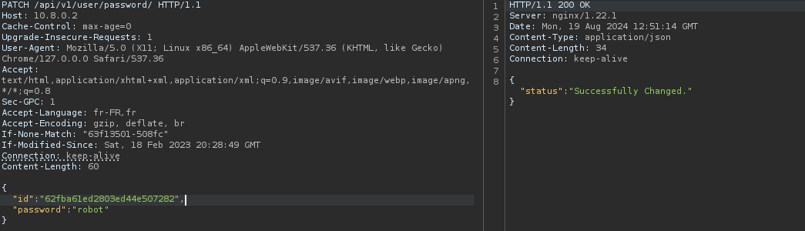

Une fois le mot de passe modifié, je me connecte à l'application en utilisant les nouvelles informations d'identification.

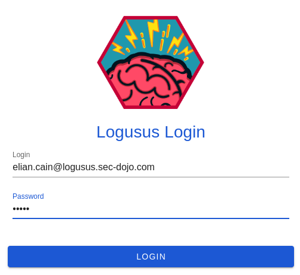

Une fois connecté, un token d'accès m'est attribué.

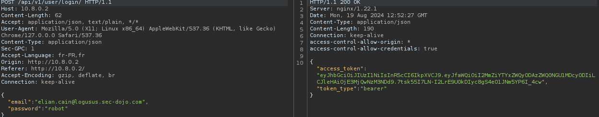

Sur le dashboard, je découvre toutes les API disponibles pour le système.

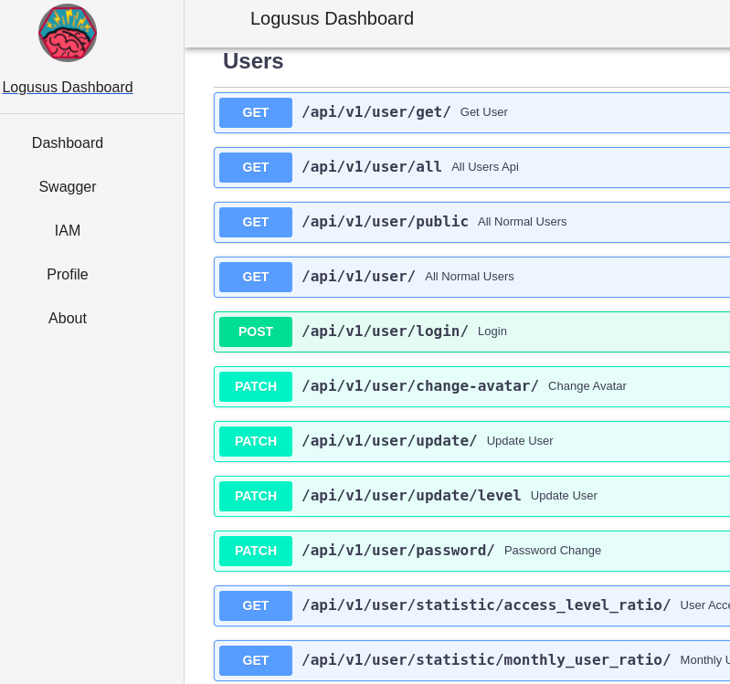

### Recherche d'autres utilisateurs

J'essaie d'accéder à l'api `/api/v1/user/all`, mais je n'ai pas les privilèges nécessaires.

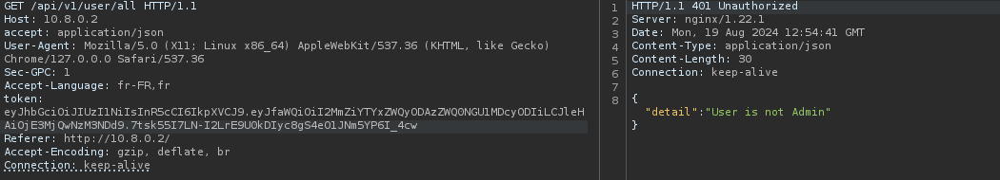

En utilisant l'api `/api/v1/user/`, je parviens à lister un autre utilisateur avec un `"access_level": 49`

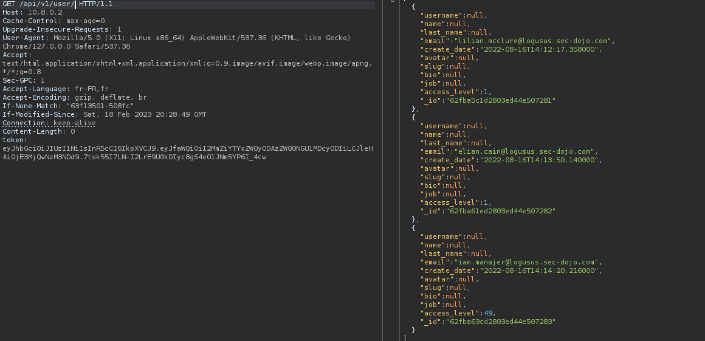

J'essaie de modifier son mot de passe mais ce compte n'a pas le droit de changer son mot de passe.

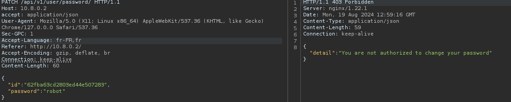

## Escalade des privilèges

Après une recherche approfondie, je découvre l'api `/api/v1/user/update/`.

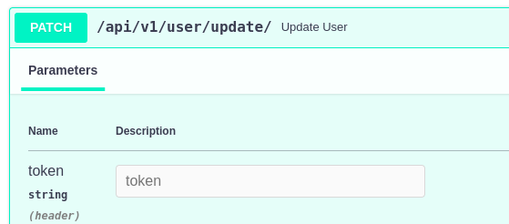

Qui me permet de changer le mot de passe de cet utilisateur.

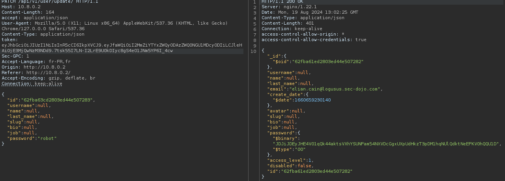

Je me connecte avec ce compte pour continuer l'exploitation avec son token.

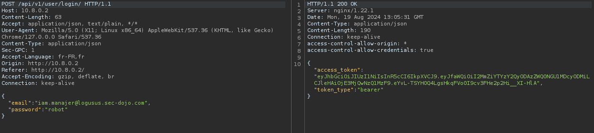

Après avoir exploré plusieurs API, je découvre `/api/v1/user/change-avatar/`. En tentant de changer l'avatar via cette API, une erreur se produit.

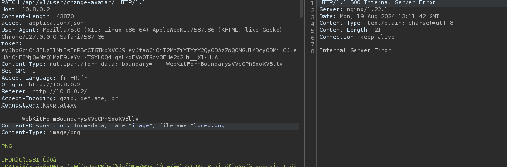

Je constate qu'une vulnérabilité LFI (Local File Inclusion) existe au niveau du `filename` par essais et erreurs.

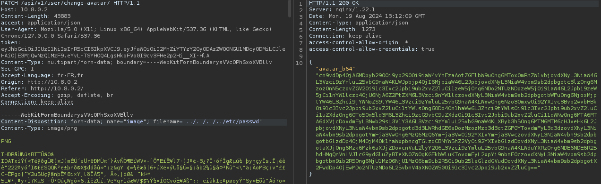   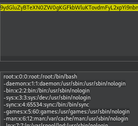

En exploitant cette LFI, je parviens à accéder au flag.

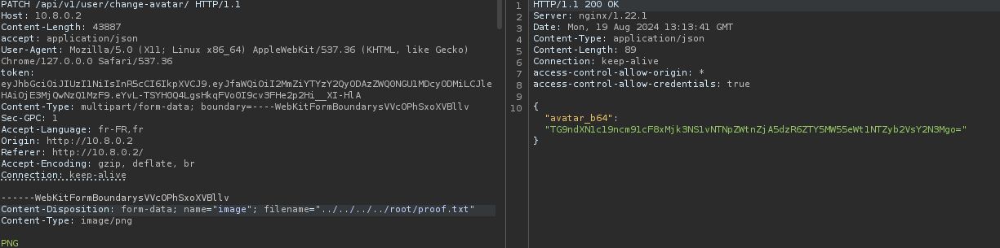
