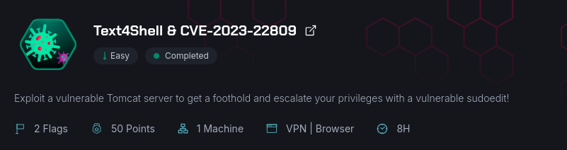
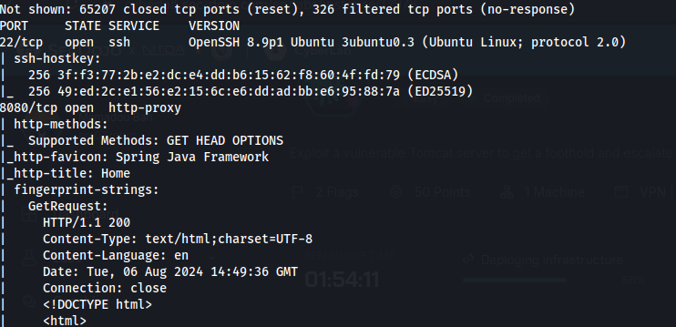
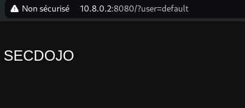
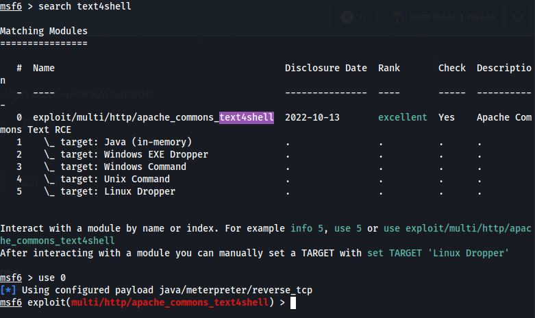
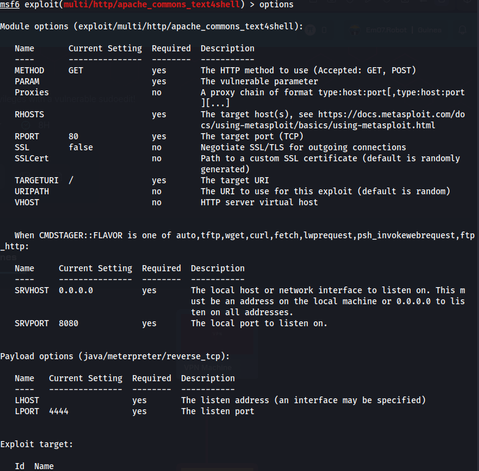
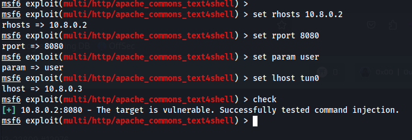
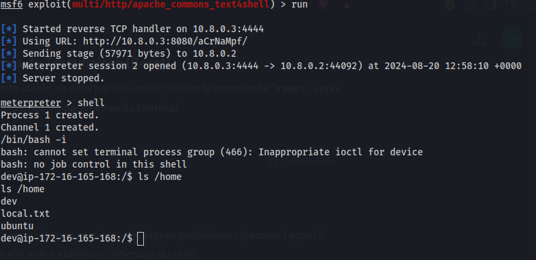
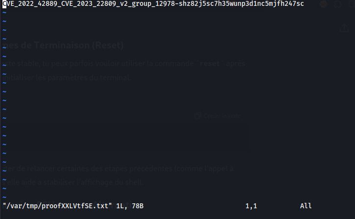

# SecDojo:  Text4Shell & CVE-2023-22809



## Scan Initial

J'ai commencé par effectuer un scan Nmap pour identifier les ports ouverts sur la machine cible.



Les résultats montrent que les ports 22 (SSH) et 8080 (HTTP) sont ouverts.

## Accès au Site Web

Je me rends sur mon navigateur à l'adresse `http://10.8.0.2:8080/` pour explorer les services disponibles. Je découvre une application web en cours d'exécution.



## Exploitation de la Vulnérabilité Text4Shell

Je lance Metasploit pour exploiter la vulnérabilité `Text4Shell`. Je commence par sélectionner l'exploit et configurer les options nécessaires.

     

Avant de lancer l'exploitation, je vérifie si la cible est vulnérable. La vérification indique que la cible est vulnérable à l'exploit. Je procède alors à l'exploitation.



## Exploitation

Je lance l'exploit pour obtenir une session sur la machine.



Une fois l'exploit réussi, j'obtiens un accès shell sur la machine cible.

## Escalade de Privilèges via sudoedit

Je vérifie les privilèges de l'utilisateur actuel avec la commande `sudo -l`. Je remarque que l'utilisateur a des droits sur sudoedit sur le fichier `/etc/hosts`, ce qui peut être abusé pour l'escalade de privilèges. J'utilise la commande ci-dessous pour avoir le flag de `root`

```bash
EDITOR="vim -- /root/proof.txt" sudoedit /etc/hosts
```


