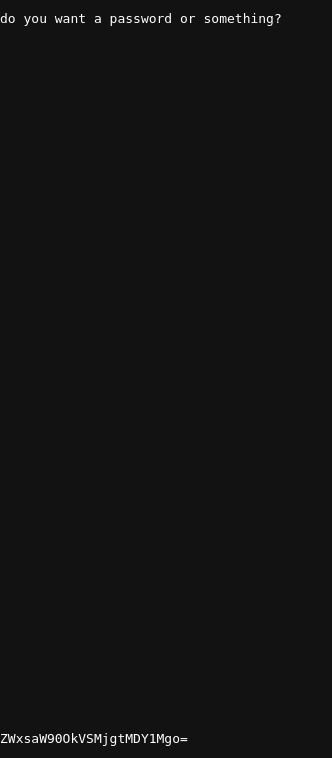
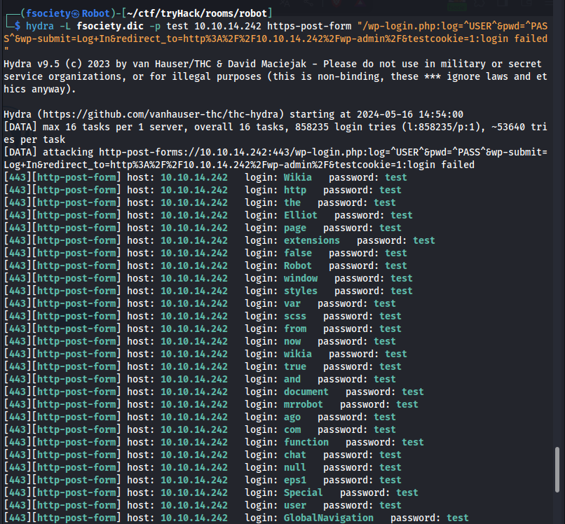
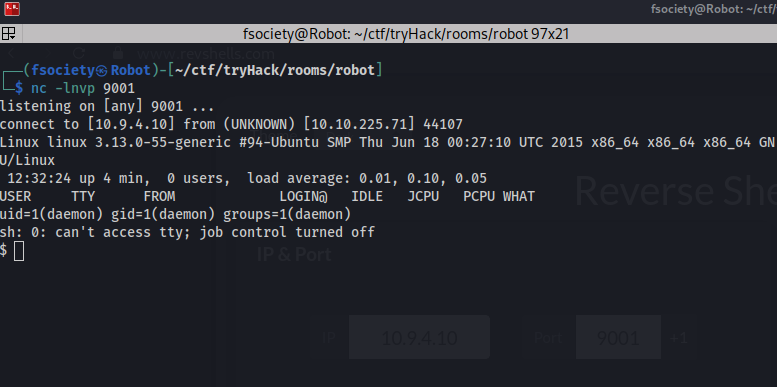

# TryHackMe: Mr Robot CTF


## Tâche 1 : Connexion au réseau TryHackMe

Pour déployer une machine et interagir avec, vous devez d'abord vous connecter au réseau de TryHackMe.

### Instructions détaillées

1. **Téléchargement du fichier de configuration :**
   - Allez sur la [page d'accès TryHackMe](https://tryhackme.com/r/access).
   - Téléchargez votre fichier de configuration OpenVPN (`username.ovpn`).

2. **Connexion avec OpenVPN :**
   - Ouvrez un terminal (Linux) ou une fenêtre de commande (Windows). Exécutez la commande suivante pour vous connecter avec votre fichier de configuration :

     ```bash
     sudo openvpn --config username.ovpn
     ```
     Ou
     
     ```bash
     sudo openvpn username.ovpn
     ```

   - Sur Windows, vous pouvez utiliser un client graphique comme [OpenVPN GUI](https://openvpn.net/community-downloads/) et importer votre fichier `.ovpn`.
   - Pour les utilisateurs d'Android avec Termux, vous pouvez télécharger l'application OpenVPN sur le Play Store : [OpenVPN pour Android](https://play.google.com/store/apps/details?id=net.openvpn.openvpn&pcampaignid=web_share).

3. **Vérification de la connexion :**
   - Une fois connecté, allez sur la page d'accès TryHackMe et actualisez-la. Vérifiez que vous voyez une coche verte à côté de `Connected`. Notez l'adresse IP interne affichée, qui sera utilisée pour accéder aux machines virtuelles déployées. Vous pouvez aussi tester la connectivité avec la commande `ping`.

     ```bash
     	ping <adresse_ip_interne>
     ```

---

### Réponses aux questions

Vous devez vous connecter pour répondre aux questions sur la page de la machine Mr. Robot sur TryHackMe.

## Remarques

Remplacez `username.ovpn` par le nom du fichier que vous avez téléchargé.

## Tâche 2 : Piratez la machine

Dans cette tâche, nous allons pirater la machine virtuelle Mr. Robot. L'objectif est de rooter la machine, ce qui signifie obtenir un accès de super-utilisateur (root). Il s'agit d'une machine destinée aux débutants/utilisateurs intermédiaires.

### Démarrer la machine

1. **Démarrage de la machine :**
   - Allez sur la page de la machine Mr. Robot sur TryHackMe. Démarrez la machine virtuelle en cliquant sur le bouton "Start Machine".
   
   
   
   

2. **Objectif de la tâche :**
   - Notre objectif principal est de rooter la machine Mr. Robot. Il y a 3 clés cachées situées sur la machine. Notre mission est de les trouver.

3. **Scan initial avec nmap :**
   - La première étape dans le processus de piratage est généralement de scanner la machine cible pour découvrir les services ouverts et les vulnérabilités potentielles.
   - J'ai lancé un scan avec nmap en utilisant la commande suivante :

     ```bash
     	sudo nmap -p- -Pn --min-rate 10000 -v -A 10.10.14.242
     ```

     Cela effectue un scan sur tous les ports (`-p-`), désactive la découverte de l'hôte (`-Pn`), utilise un taux de balayage minimum de 10000 paquets par seconde (`--min-rate 10000`), active la verbosité pour obtenir plus d'informations (`-v`), et active l'option d'analyse complète (`-A`).

   - Voici un aperçu des résultats de nmap :
     - Port 80 (HTTP) : Ouvert
     - Port 443 (HTTPS) : Ouvert
     - Port 22 (SSH) : Fermé

    

4. **Exploration des ports ouverts :**
   - Étant donné que les ports 80 et 443 sont ouverts, nous allons nous rendre sur notre navigateur pour explorer ces services.

    

5. **Recherche de fichiers intéressants :**
   - La première chose qui me vient à l'esprit est de vérifier si le fichier `robots.txt` existe.

    

   - Nous trouvons notre première clé ainsi qu'un fichier `fsociety.dic`, qui est probablement un dictionnaire de mots contenant des noms d'utilisateur et/ou des mots de passe.
	
	*Téléchargement des fichiers :*
	
   - J'utilise les commandes suivantes pour télécharger les fichiers :

     ```bash
     	wget http://10.10.14.242/fsocity.dic
     	wget http://10.10.14.242/key-1-of-3.txt
     ```

6. **Recherche de la deuxième clé :**
   - Nous utilisons un outil de fuzzing pour voir s'il y a d'autres répertoires intéressants et découvrons que le site est un site WordPress.
   
   
   
   - En verifiant les autres repertoires je trouve quelque chose sur le repertoire `license`
   
  

   - En allant jusqu'en bas, je trouve un texte encodé en base64.

  

   - En décodant, on trouve le credential.

    
    
   - Nous pouvons aussi utiliser une autre méthode en utilisant hydra pour forcer brutalement le login. On essaie de se connecter sur la page et de capturer la requête envoyée en utilisant Burp Suite.

    

   - On voit que la requête envoyée lors d'une tentative de connexion est `log=admin&pwd=admin&wp-submit=Log+In&redirect_to=http%3A%2F%2F10.10.14.242%2Fwp-admin%2F&testcookie=1`.

   - Nous tentons de nous connecter, mais nous nous rappelons du fichier `fsocity.dic` que nous avons déjà. Nous réfléchissons donc à une attaque par force brute en utilisant `hydra`. J'utilise la commande suivante pour bruteforcer le username :
     ```bash
      hydra -L fsociety.dic -p test  10.10.14.242 http-post-form "/wp-login.php:log=^USER^&pwd=^PASS^:login failed"
     ```
      

    Avec `-L` pour spécifier une liste de mots et `-p` pour le mot de passe.
    
   - Nous nous rendons sur la page de connexion par défaut des sites WordPress à l'adresse `/wp-login`.

    
	
   - On essaie de verifier  les nom que nous avons eu avec hydra et on voit que le username `elliot` est valide
   
   

   - Ensuite, j'utilise la commande suivante pour trouver le mot de passe :
     ```bash
    	hydra -l "elliot" -P fsociety.dic 10.10.14.242 http-post-form "/wp-login.php:log=^USER^&pwd=^PASS^:Incorrect"
     ```
     
    
    
   - Une fois connecté on essaie d'obtenir un reverse shell on se rend sur le site [reverse shell](https://www.revshells.com). On entre notre ip et un port 
   - NB: c'est l'ip de l'interface de notre vpn qu'il faut entrez
    
    
    
   - Sur le site dans l'onglet `Appearance` on modifie un fichier php (ici le fichier 404.php) et on colle notre code malveillant pour obtenir le reverse shell
   
   
   
   - Sur notre terminal on configure un serveur pour ecouter les connexion entrant sur le port que nous avons configurer sur le site reverse shell `9001` que j'ai utilise. Ensuite on declenche un code 404 sur la machine cible pour que notre code s'execute (le  404.php) que nous avons modifier. En entrant n'importe quoi sur le site ex ip/nothing le 404.php est executer. Ensuite on obtient notre reverse shell

   
   
   - Une fois connecter on essaie d'obtenir un shell beaucoup plus interractif avec la commande `python3 -c 'import pty;pty.spawn("bash")'`. Sur la machine cible on trouve notre deuxieme cle et un fichier contenant un hash md5 du user robot que nous allons cracker par la suite
   
   
   
   - On utilise le site [crackStation](https://crackstation.net) pour cracker le mot de pass
   
   
   
   - Ensuite on change d'utilisateur pour se connecter en tant que robot avec la commande `su robot` Pour lire le contenu de la deuxieme cle 
   
7. **Recherche de la troisieme clé :**

   - En general la derniere partie est toujours une escalation de privilege. Donc on sait que la troisieme cle se trouve dans le repot root oubien dans un fichier que seul root est capable de lire donc on doit rooter la machine
   - La premiere des choses qui me vient a l'esprit c'est de chercher avec quel command mon user actuel est capable d'executer avec des privilege. J'utilise la commande `sudo -l` mais la sortie nous dit que le user robot n'est pas un sudoers donc je cherche d'autres moyen. Et la deuxieme methode c'est de trouver des executables avec le bit suid qui nous permet d'executer  avec les priviliges du proprietaire avec la commande `find / -type f -perm -4000 -exec ls -l {} \; 2>/dev/null`.
   
   
   
   -On voit beaucoup d'executable du coup on utilise le site [gtfobins](https://gtfobins.github.io/) pour voir comment avoir les privilege root avec l'une des executables. Et on trouve un moyen d'obtenir les privileges avec l'excutable nmap en utilisant la commande `nmap --interactive` ensuite on entre `!sh`
   
   
